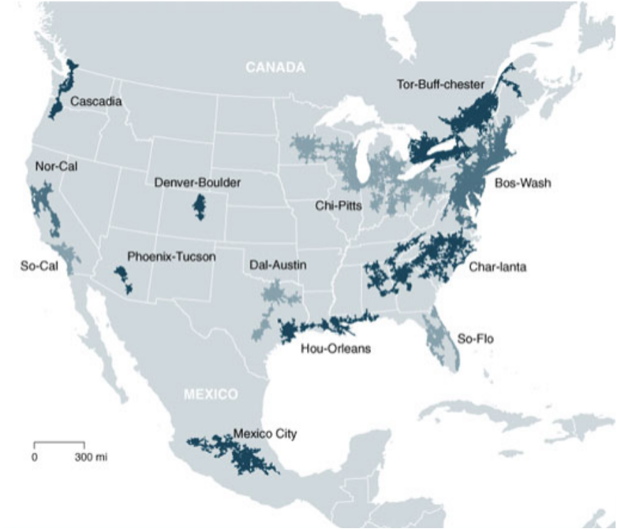

## *Megaregions*
The idea of “megaregions” as geographic economic units has grown in popularity in the last several years, due in part to a shift in understanding of economic activity as it relates to the effects of globalization and the subsequent change in cities’ relationship with surrounding areas. Put briefly, Spofford Design’s strategies for developing a network of manufacturers, designers, and consumers, and the concomitant marketing and partnership efforts, will center around regions defined by dynamics such as inter-city transportation, culture, manufacturing capacity, and land use patterns. We will capitalize on existing, underappreciated dynamics that already occur, scaling deeply within these regions, replicating rather than broadening, and localizing solutions as much as possible.

We assume that by leveraging the megaregion paradigm, we will cultivate deeper ties with existing entities in those regions and establish a more “bottom-up” approach to the solutions we develop in service of the megaregional communities that mitigates Spofford Design’s risk of developing something with a poor fit for network members, a common drawback of a more traditional, linear, top-down approach.

Megaregions are large networks of metropolitan regions that share the following:
* environmental systems
* infrastructure systems
* economic linkages
* settlement/land use patterns
* culture or history
Economic and sociological studies by scholars and groups such as America 2050, Lang and Dhavale, Richard Florida, and the Center for Quality Growth and Regional Development (Georgia Institute of Technology) argue that between now and 2050, **more than half of the nation’s population growth and as much as two-thirds of its economic growth will occur in eight to eleven megaregions**, depending on the study. These figures correspond with trends occurring outside of the United States, with regions such as the greater Buenos Aires to Rosario corridor in Argentina, the Nile River Delta, and the Pearl River Delta developing along similar trajectories.

An understanding of the benefits of working within these regions as an economic paradigm is nothing new, and Spofford Design again points to the example of Italy. Two examples stand out, and for different reasons: Emilia-Romagna and Lombardy. Because of the unique history of Italy, both of these regions’ borders reflect economic activity more than they reflect arbitrary administrative lines. Northern Italy’s innovation network (which includes hubs like Milan), and the global brand it has created, is synonymous with taste and forward thinking design that supersedes that of any one company. This regional brand strength illustrates how the firms within the region benefit from simply participating in the region’s economy beyond simple transactional engagement.

In the case of Emilia-Romagna, scholars have written endless case studies on its largely co-operative economy, which represents a real life alternative to how a region can serve as a resilient economic engine while remaining an inclusive environment in which everyone has a stake. In both cases, the high internal economic activity created a sophisticated internal demand for both specialized, highly skilled labor and a supply of educated and informed consumers with the means to purchase top quality goods.

While the total number and exact boundaries of North America’s megaregions vary somewhat from study to study, clear patterns emerge, and suggest for the purposes of Spofford Design the megaregions in which we would choose to do business. Criteria for choosing these megaregions include:
* existing manufacturing capacity
* government support for innovation
* adjacency to other megaregions
* an abundance of raw materials
* access to both universities
* sufficiently large cities to market products.

A decentralized strategy provides Spofford Design with three specific strengths to overcome the issues which have dogged the legacy home furnishings industry: consumer connection, efficiency, and workforce satisfaction. The connections between decentralized facilities can create greater innovation, faster learning and adaptation, and faster opportunity identification. Companies that opt for a decentralized production strategy have demonstrated these traits:
* Increased Motivation and creativity
* Flexibility
* More Detailed and relevant information

While research into megaregions have all focused on delineating geo-spatial scales, primarily for public sector governance issues (such as transportation and urban planning, housing, natural resource management and census descriptors), Columbia University’s Saskia Sassen has considered the functional aspects of megaregions, particularly related to agglomeration economies, including equity and environmental considerations. Spofford Design has the ability to strategically focus on megaregions, and harness the potential of that geographic scale.

These regions also all possess what Sassen refers to as “diverse spatial logics”, or a variety of land use options to support a diversity of economic activity, which creates the conditions for re-localizing and rebuilding value chains that have been sourced offshore. This geographic scale also provides opportunities to reconnect provincial cities and towns to the globally-urbanized regions, creating more opportunities beyond the “winner-take-all” urban economies, which have created the laggard regions who have not seen the benefits of a global economy.

## *Alternative Economies and Market Understanding*
Spofford Design seeks to create an alternative economic model that operates according to principles such as labor rights, environmental sustainability, inclusivity, and as close to 100% regional sourcing as possible. Rather than seeing these principles as constraints, we believe as most social entrepreneurs believe: these principles make us not only good stewards of our communities, societies, and the earth, but they’re good business. Companies that ignore principles like these at their peril in the long term. As a generative, rather than extractive force, we create more wealth for everyone in the most inclusive sense, that we as a company share in as well.

Such a feat would be impossible without including in its delineation of the various megaregions consideration of the diversity of materials to which its network members have access, as well as high variation between high- and low-density areas and clusters necessary to complete different tasks and processes. Our assumption is that such considerations for the internal dynamics of each regional system will result in a regional collection of product offerings highly distinct from the products of other megaregional networks. When considering that dynamic alongside the robust discourse within a megaregion between manufacturers, designers, and consumers Spofford Design expects to help bring about a level of product innovation not seen for decades.

While we pay much greater attention to the consumer experience (and how we plan to improve it) in other sections, the importance of that component of the discussion merits mention here. We assume that consumer preference varies between each megaregion based on taste, culture, or practicality. However, scant scholarly level research exists to support this. This has led Spofford Design to seek the advice with business scholars currently working in eminent business schools in the United States to better understand this and other similar questions. As a part of this we have initiated our own consumer sentiment survey. Thinking about how to take advantage of the ever growing demand for furniture requires a deeper and more holistic understanding of the consumer experience than is available. We intend on deepening our relationships with these scholars to ensure the most rigorous study of our market and business model as is possible, and eventually partner on projects to benefit all of our endeavors.

## *Competition*
Certainly the market for consumer furniture hasn’t been without its new entrants. From digital design helpers like Havenly, to high tech computer vision tools like Modsy, to online retailers like Wayfair, to furniture manufacturers like Joybird, startups have started to chip away at the edifice of consumer furniture. Spofford Design believes these companies have missed the opportunity in large part because they innovate in one area while performing poorly in everything else, often significantly so.

In contrast, Spofford Design aims to bring consumers into the innovation community itself. We focus on the humans behind the relationships, and treat everyone as creators, in need of acknowledgement, support, and validation derived from connection with others. The megaregional approach extends most of all to consumers, who will connect with a regional sensibility as they create their spaces and homes, much as farm-to-table has connected their dinner tables to place where they live.
